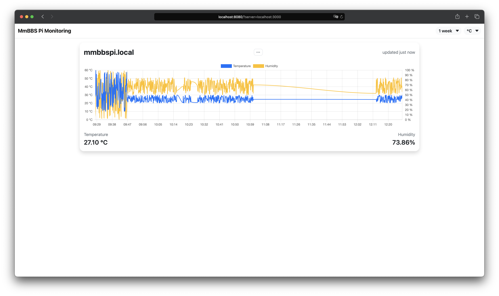

# MMBbS Pi Monitoring

A simple tool for [Multi-Media Berufsbildende Schulen (MMBbS)](https://www.mmbbs.de) allowing you to connect multiple Raspberry Pis (or other devices with GPIO pins) to a central server in order to collect temperature and humidity data (eg. in a server rack).

This project consists of three sub-projects: the main server to collect the data, the client for running on the Raspberry Pi, and a Web UI to display temperature and humidity data in a user friendly way.

Running this project requires [Node.js](https://nodejs.org/en/) installed (>= 16.x recommended). For installing Node.js on your Pi, [NVM](https://github.com/nvm-sh/nvm) is recommended.

## Server

Running the server on its own does not depend on a Raspberry Pi, but you can run it on basically any device with a network connection that supports Node.js.

To start the server, run the following commands:

```sh
$ cd server

# Installing packages is required only once!
$ npm install

$ npm start
```

The server will be reachable on port 3000 (or whatever the `SERVER_PORT` env variable is set to).

### Options
Options can be set by editing `server/.env`.

| Variable | Default | Description |
|---|---|---|
| SERVER_PORT | `3000` | Sets the TCP port the server is listening on. |
| DATABASE_FILENAME | `db.sqlite` | Sets the filename of the SQLite database to use. |

## Client

The client supports both DS18x20 (temperature only) and DHTxx (temperature + humidity) sensors. To force the usage of a DHT type sensor, set `USE_DHT_SENSOR` in `.env` to `1`, alongside the type of DHT sensor you're using (`DHT_TYPE`, both `11` and `22` supported) and the GPIO pin the sensor is connected to (`DHT_GPIO`).

If you're using a DS18x20 type sensor, you need to make sure the driver and kernel modules are loaded correctly.  
On a Raspberry Pi, add the following lines to `/boot/config.txt`:

```
dtoverlay=w1-gpio,gpiopin=4
dtoverlay=w1-therm
```

**Note:** Replace `gpiopin=4` with the GPIO pin the sensor is connected to.

Additionally, add the following lines too `/etc/modules`:

```
w1_therm
w1_gpio
```

Finally, add these lines to `/etc/rc.local` before the final `exit 0` to enable the internal pull-up resistor on the correct port. Again, replace the `4` with the port your sensor is connected to.

```
raspi-gpio set 4 ip pu
```

Reboot your device, and you should be seeing a device under `/sys/bus/w1/devices` that is NOT `w1_bus_master1` and where the identifier is NOT mostly zeroes.

To start the client, run the following commands:

```sh
$ cd client

# Installing packages is required only once!
$ npm install

$ npm start
```

The client will register with the server specified in `client/.env` automatically. If it fails to connect, it will retry every 10 seconds.  
Once connected, the client will start pushing its data to server every 10 seconds (or whatever the `UPDATE_INTERVAL` env variable is set to).

Please check your Ethernet/WiFi interface names! Pi defaults should be `eth0` and `wlan0` respectively.  
Queried interface names can be changed in `client/index.js`, lines 11 & 12;

### Options
Options can be set by editing `client/.env`.

| Variable | Default | Description |
|---|---|---|
| MONITOR_URL | `http://localhost:3000` | Sets the connection URL of the monitor server to connect to. |
| UPDATE_INTERVAL | `10` | Specifies the interval in which to push data to the monitor server. |

## Web UI



The Web UI is used to display historical data of each known monitor node. Temperature can be displayed in Celsius, Fahrenheit, Kelvin, or even historical units such as Rankine and Réaumur.

Usually, the server provides access to the Web UI. In case you want to make changes to it, you can start the Web UI independently from the server.  
To start the Web UI, run the following commands:

```sh
$ cd ui

# Installing packages is required only once!
$ npm install

$ npm run dev

# Build Web UI to be served statically (optional)
$ npm run build
```

After starting, the Web UI can be reached under `http://localhost:8080`.  
By default, it will connect to `http://{hostname}:3000` to display data. This can be overriden by specifying the `server` GET parameter (eg. `https://localhost:8080?server=10.3.3.7:42069`).